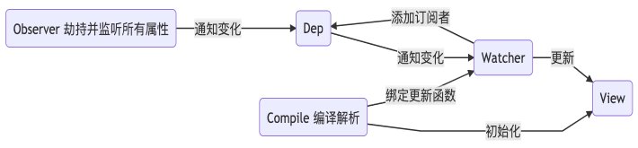

# MiniVue
用一个项目记录一下vue和webpack的学习～～

## 双向绑定原理

# Webpack

## Reference
[1] https://www.cnblogs.com/libin-1/p/6893712.html

[2] https://github.com/woai3c/mini-vue/tree/v0.1

[3] https://www.jianshu.com/p/df17e05abf94
